# 프로젝트 아키텍처 (ARCHITECTURE.md)

**문서 목적**: 이 문서는 '기획자를 위한 노코드 빌더' 프로젝트의 기술 아키텍처, 주요 결정 사항, 코드베이스 구조를 정의합니다. 모든 개발자는 이 문서를 통해 프로젝트의 기술적 방향성에 대한 공통된 이해를 갖습니다.

**MVP 범위**: MVP 단계에서는 백엔드 및 데이터베이스 없이, 프론트엔드 단독으로 동작하는 애플리케이션을 목표로 합니다. 모든 데이터는 브라우저의 `localStorage`에 저장됩니다.

## Revision History

| Version | Date | Author | Description |
| :--- | :--- | :--- | :--- |
| 0.1 | 2025-06-20 | raon.c | 최초 작성 (MVP 기준) |
| 0.2 | 2025-06-21 | raon.c | 스토리지 추상화 / GitHub Pages 배포 반영 |
| 0.3 | 2025-06-22 | raon.c | UI 빌더 레이아웃(Structure/Property 탭) & 어댑터 전환 흐름 추가 |
| 0.4 | 2025-06-22 | raon.c | 기술 스택 섹션 추가, 최신 버전 업데이트 (Next.js 15+, Zustand 5+, Zod 4+, Tailwind 4+), biome 도입, IndexedDB 저장소 옵션 추가 |

---

## 1. 핵심 아키텍처 원칙 (Guiding Principles)

- **모듈성 (Modularity)**: 기능(Epic)별로 코드를 분리하여 유지보수성과 재사용성을 높입니다. '빌더 엔진', '프로젝트 관리', '공유' 등 각 도메인은 독립적으로 개발 및 테스트가 가능해야 합니다.
- **컴포넌트 기반 (Component-Driven)**: 프론트엔드는 재사용 가능한 컴포넌트의 조합으로 구성됩니다. 이는 PRD의 핵심 사상과 일치하며, 일관된 UI와 개발 효율을 보장합니다.
- **관심사의 분리 (Separation of Concerns)**: UI 빌더의 핵심 로직은 특정 디자인 라이브러리에 종속되지 않아야 합니다. 어댑터 패턴을 통해 UI 렌더링 계층을 분리하여 디자인 시스템을 유연하게 교체할 수 있도록 합니다.
- **타입 안정성 (Type Safety)**: 전체 코드베이스에 TypeScript를 적용하여 컴파일 타임에 에러를 감지하고, 코드의 안정성과 가독성을 높입니다.

---

## 2. 기술 스택 (Technology Stack)

MVP 단계에서 사용되는 핵심 기술 스택을 다음과 같이 정의합니다.

### 2.1. 프론트엔드 (Frontend)

| 카테고리 | 기술 | 버전 | 선택 이유 |
| :--- | :--- | :--- | :--- |
| **프레임워크** | Next.js | 15+ | Static Export 지원, React 기반, 개발 경험 우수 |
| **언어** | TypeScript | 5+ | 타입 안정성, 개발 생산성 향상 |
| **상태 관리** | Zustand | 5+ | 가벼움, 간단한 API, 미들웨어 지원 |
| **Drag & Drop** | dnd-kit | latest | 접근성 우수, 모던한 API, 커스터마이징 용이 |
| **스키마 검증** | Zod | 4+ | 런타임 타입 검증, TypeScript 통합 |
| **스타일링** | Tailwind CSS | 4+ | 유틸리티 퍼스트, shadcn/ui와 호환성 |

### 2.2. UI 라이브러리 (Design Systems)

| 라이브러리 | 용도 | 설치 방식 | 우선순위 |
| :--- | :--- | :--- | :--- |
| **shadcn/ui** | 기본 디자인 시스템 | CLI 기반 소스 복사 | Primary |
| **Material-UI** | 대안 디자인 시스템 (POC) | npm 패키지 | Secondary |
| **Lucide React** | 아이콘 | npm 패키지 | Primary |

### 2.3. 개발 도구 (Development Tools)

| 카테고리 | 도구 | 용도 |
| :--- | :--- | :--- |
| **패키지 매니저** | pnpm | 의존성 관리, 빠른 설치 |
| **린터** | biome | 코드 품질, 포맷팅, 빠른 속도 |
| **타입 체킹** | TypeScript Compiler | 컴파일 타임 타입 검증 |
| **빌드 도구** | Next.js built-in | 번들링, 최적화 |

### 2.4. 테스트 (Testing)

| 수준 | 도구 | 용도 |
| :--- | :--- | :--- |
| **단위 테스트** | Vitest | 빠른 실행, ESM 지원 |
| **컴포넌트 테스트** | @testing-library/react | React 컴포넌트 테스트 |
| **UI 테스트** | Storybook | 컴포넌트 문서화, 시각적 테스트 |
| **E2E 테스트** | Playwright | 브라우저 자동화, 통합 테스트 |

### 2.5. 배포 & CI/CD (Deployment)

| 카테고리 | 도구/서비스 | 용도 |
| :--- | :--- | :--- |
| **호스팅** | GitHub Pages | 정적 사이트 배포 |
| **CI/CD** | GitHub Actions | 자동화된 빌드, 테스트, 배포 |
| **도메인** | GitHub Pages 기본 | `username.github.io/repository` |

### 2.6. 데이터 저장 (Data Storage - MVP)

| 저장소 | 용도 | 제한사항 |
| :--- | :--- | :--- |
| **localStorage** | 프로젝트 데이터, 사용자 설정 | 브라우저별 5-10MB 제한 |
| **sessionStorage** | 임시 상태 (Undo/Redo 히스토리) | 세션 종료 시 삭제 |
| **IndexedDB** | 프로젝트 데이터 영구 저장 | 고용량의 데이터 저장 필요시 |

---

## 3. 최상위 아키텍처 (High-Level Architecture - MVP)

MVP 단계에서는 클라이언트 측 렌더링과 로컬 저장을 사용하는 순수 프론트엔드 아키텍처를 따릅니다.


---

## 4. 프론트엔드 아키텍처 (Frontend Architecture)

- **프레임워크**: Next.js (React) — *Static Export 모드 (`next export`)*
- **상태 관리**: Zustand
- **Drag & Drop**: dnd-kit
- **데이터 영속성 (MVP)**: `localStorage` *(스토리지 추상화 계층 위에 구현)*

### 4.1. 디자인 시스템 아키텍처: 어댑터 패턴

특정 UI 라이브러리(예: `shadcn/ui`, `Material-UI`)에 종속되지 않는 유연한 구조를 위해 **어댑터 패턴**을 도입합니다.

```mermaid
flowchart LR
    %% 노드
    core["빌더 코어\n(캔버스, 상태, 속성 UI)"]
    adapter["어댑터\n컴포넌트·스키마 레지스트리"]
    libA["디자인 라이브러리 A\n(shadcn/ui)"]
    libB["디자인 라이브러리 B\n(Material-UI)"]

    %% 관계
    core -->|"추상 타입 · props"| adapter
    adapter -->|"매핑된 컴포넌트"| libA
    adapter -. "핫스왑" .-> libB

    %% Styling (optional)
    classDef lib fill:#f6f8fa,stroke:#ccc;
    class libA,libB lib;
```



- **UI 빌더 코어**: 빌더의 핵심 로직입니다. 'Button'이라는 추상적인 타입만 알 뿐, 그것이 어떻게 생겼는지는 관심 없습니다. 캔버스에 `Node` 데이터를 렌더링하고, 속성 편집기를 통해 Node의 `props`를 수정하는 역할만 합니다.
- **디자인 라이브러리**: `shadcn/ui`, `Material-UI` 등 실제 UI를 구성하는 React 컴포넌트들의 집합입니다.
- **어댑터**: 가장 중요한 연결고리입니다. UI 빌더와 특정 디자인 라이브러리를 연결합니다.
    - **역할 1 (컴포넌트 등록)**: 빌더가 아는 추상 타입('Button')과 실제 React 컴포넌트(`shadcn/ui`의 Button)를 매핑하는 `ComponentRegistry`를 제공합니다.
    - **역할 2 (속성 스키마 정의)**: 각 컴포넌트가 편집 가능한 속성(`props`)이 무엇인지 정의합니다. (예: 'Button'은 `variant`라는 속성을 가지며, 선택지는 'primary', 'secondary'이다). 이 스키마를 기반으로 속성 편집기가 동적으로 렌더링됩니다.

> **장점**: `Material-UI`용 어댑터를 새로 만들어 갈아 끼우기만 하면, 빌더 코어 로직 수정 없이 전체 UI의 룩앤필(Look-and-Feel)을 변경할 수 있습니다.

### 4.2. 디렉토리 구조 (Feature-based)

어댑터 패턴을 반영하여 디렉토리 구조를 다음과 같이 정의합니다.

```
/src
├── /app                 # Next.js App Router (라우팅)
├── /components          # 1. 빌더의 UI를 구성하는 전역 컴포넌트
│   ├── /shadcn              #    - shadcn/ui 기반 컴포넌트 (기본)
│   │   ├── button.tsx   #      - shadcn/ui CLI로 생성된 Button 컴포넌트
│   │   ├── input.tsx    #      - shadcn/ui CLI로 생성된 Input 컴포넌트
│   │   └── ...          #      - 기타 shadcn/ui 컴포넌트들\
│   └── /company-ds      #    - 회사 자체 디자인 시스템 컴포넌트들 (예시)
│       ├── button.tsx   #      - 회사 Button 컴포넌트
│       ├── input.tsx    #      - 회사 Input 컴포넌트
│       └── ...          #      - 기타 회사 컴포넌트들
├── /features            # 2. 도메인/기능별 로직
│   ├── /builder         #    - 빌더 코어 로직 (캔버스, 속성편집기 등)
│   └── /projects        #    - 프로젝트 대시보드
├── /adapters            # 3. 디자인 시스템 어댑터
│   ├── /shadcn          #    - shadcn/ui 어댑터 (기본)
│   │   ├── components.ts  #      - 컴포넌트 등록 및 매핑
│   │   ├── schema.ts      #      - 속성 편집 스키마 정의
│   │   └── index.ts       #      - 어댑터 엔트리포인트
│   ├── /mui             #    - Material-UI 어댑터 (POC) 
│   │   ├── components.ts  #      - 컴포넌트 등록 및 매핑
│   │   ├── schema.ts      #      - 속성 편집 스키마 정의
│   │   └── index.ts       #      - 어댑터 엔트리포인트
│   └── /company-ds      #    - 회사 디자인 시스템 어댑터 (예시)
│       ├── components.ts  #      - 컴포넌트 등록 및 매핑
│       ├── schema.ts      #      - 속성 편집 스키마 정의
│       └── index.ts       #      - 어댑터 엔트리포인트
├── /lib                 # 전역 유틸리티 함수
├── /store               # Zustand 스토어 (상태 관리)
└── /types               # 전역 타입 정의
```

#### 실제 디자인 라이브러리 컴포넌트 위치

| 라이브러리 | 컴포넌트 위치 | 설치 방법 |
| :--- | :--- | :--- |
| **shadcn/ui** | `/src/components/shadcn/` | `npx shadcn-ui@latest add button input` 등으로 개별 컴포넌트 설치 |
| **Material-UI** | `node_modules/@mui/material/` | `npm install @mui/material @emotion/react @emotion/styled` |
| **회사 디자인 시스템** | `/src/components/company-ds/` | 사내 CLI 도구 또는 수동 복사 |
| **Ant Design** | `node_modules/antd/` | `npm install antd` |

#### 어댑터에서 실제 컴포넌트 매핑 예시

```typescript
// /src/adapters/shadcn/components.ts
import { Button } from '@/components/shadcn/button'
import { Input } from '@/components/shadcn/input'
import { Card } from '@/components/shadcn/card'

export const shadcnComponentRegistry = {
  Button: Button,
  Input: Input,
  Card: Card,
  // 빌더에서 사용할 추상 타입 → 실제 shadcn/ui 컴포넌트 매핑
}
```

```typescript
// /src/adapters/mui/components.ts
import { Button } from '@mui/material'
import { TextField } from '@mui/material'
import { Paper } from '@mui/material'

export const muiComponentRegistry = {
  Button: Button,
  Input: TextField,    // MUI에서는 TextField가 Input 역할
  Card: Paper,         // MUI에서는 Paper가 Card 역할
  // 빌더에서 사용할 추상 타입 → 실제 MUI 컴포넌트 매핑
}
```

```typescript
// /src/adapters/company-ds/components.ts
import { Button } from '@/components/company-ds/button'
import { Input } from '@/components/company-ds/input'
import { Card } from '@/components/company-ds/card'

export const companyDsComponentRegistry = {
  Button: Button,
  Input: Input,
  Card: Card,
  // 빌더에서 사용할 추상 타입 → 실제 회사 DS 컴포넌트 매핑
}
```

### 4.3. 스토리지 추상화 (Storage Abstraction)

`localStorage` 구현은 MVP의 기본 저장소이지만, **스토리지 계층을 인터페이스로 추상화**하여 언제든 다른 저장소(IndexedDB, REST API, Supabase 등)로 교체할 수 있습니다.

```typescript
// /lib/storage.ts
export interface StorageAdapter {
  getItem<T = unknown>(key: string): T | null;
  setItem<T = unknown>(key: string, value: T): void;
  removeItem(key: string): void;
}

// MVP 기본 구현
export const localStorageAdapter: StorageAdapter = {
  getItem: (key) => {
    const raw = window.localStorage.getItem(key);
    return raw ? JSON.parse(raw) : null;
  },
  setItem: (key, value) => {
    window.localStorage.setItem(key, JSON.stringify(value));
  },
  removeItem: (key) => {
    window.localStorage.removeItem(key);
  },
};
```

향후 백엔드 도입 시에는 `StorageAdapter`를 구현하는 `remoteStorageAdapter`를 추가하고 런타임 환경에 따라 주입합니다.

### 4.4. UI 빌더 레이아웃 & 상호작용 흐름

아래 구성은 PRD Epic 2 요구사항을 구현하기 위한 **최소 책임 분리(Separation of Concerns)** 구조입니다.


* **Center Canvas**: 컴포넌트 재배치·선택 전용. 텍스트 입력이나 속성 편집은 수행하지 않음. Canvas는 `DesignLibraryProvider`가 주입한 실제 React 컴포넌트를 렌더링하여, 우측 패널에서 편집된 속성을 **즉시 프리뷰**한다.
* **StructureTab**: 현재 화면의 루트 노드 자식들을 1-depth 리스트로 표시. 항목 클릭 시 해당 노드를 선택하고 `PropertyTab`을 자동 전환한다.
* **PropertyTab**: 선택된 노드의 속성을 **Zod** 스키마 기반 동적 폼으로 표시·편집한다.

### 4.5. Variant & State 스키마 설계 지침

각 어댑터의 `schema.ts` 파일은 **Zod**를 사용해 Variant/State를 정의한다. Zod 스키마는 타입 안정성을 보장하며, PRD 표준(버튼 variant, size 등)을 그대로 따르되 DX를 향상한다.

```typescript
// /adapters/shadcn/schema.ts (excerpt)
import { z } from "zod";

export const buttonSchema = z.object({
  variant: z.enum(["primary", "secondary", "ghost"]).default("primary"),
  size: z.enum(["sm", "md", "lg"]).default("md"),
  disabled: z.boolean().optional(),
  loading: z.boolean().optional(),
});

export type ButtonPropsSchema = z.infer<typeof buttonSchema>;
```

> **런타임 주입**: `DesignLibraryProvider`(React Context)에서 *현재 선택된 어댑터*의 `ComponentRegistry`와 `SchemaRegistry`를 제공한다. 라이브러리 변경 시 Provider만 교체하면 Canvas & Panel이 자동으로 재렌더링된다.

### 4.6. 새 컴포넌트 추가 플로우 (Adapter Pattern 기반)

아래 절차는 **빌더 코어**에 완전히 새로운 컴포넌트(`Badge` 예시)를 도입할 때 수행하는 표준 순서입니다. 의존성 역방향(코어←어댑터←라이브러리)을 유지해, 코어 수정은 최소화하고 확장성을 보장합니다.

| 단계 | 책임 영역 | 파일 예시 | 설명 |
| :--- | :--- | :--- | :--- |
| 1 | **타입 정의** | `/types/component.ts` | `export type ComponentType = 'Button' \| 'Input' \| 'Badge';` – 코어에서 인식할 추상 타입 추가 |
| 2 | **Schema 작성** | `/adapters/shadcn/schema.ts` | `badgeSchema` Zod 스키마 정의 (variant, color 등) |
| 3 | **컴포넌트 매핑** | `/adapters/shadcn/components.ts` | `Badge: ShadBadge` React 컴포넌트 바인딩 추가 |
| 4 | **레지스트리 등록** | `/adapters/shadcn/index.ts` | `ComponentRegistry.set('Badge', { component, schema })` |
| 5 | **디자인 라이브러리 구현** | 3rd-party 라이브러리 | shadcn/ui 혹은 MUI에서 실제 `Badge` 컴포넌트 import |
| 6 | **아이콘/카테고리 설정** | `/features/builder/constants.ts` | 좌측 패널 '컴포넌트 추가' 리스트에 아이콘 & 카테고리 메타데이터 추가 |
| 7 | **E2E / Storybook** | `/stories/Badge.stories.tsx`, Playwright spec | 스냅샷 및 플로우 테스트 추가 |
| 8 | **다른 어댑터** | `/adapters/mui/...` | 동일한 schema & 매핑을 추가해 라이브러리 전환 시 호환성 확보 |

> 💡 **의존성 규칙**: 빌더 코어는 `ComponentRegistry` 인터페이스만 알며, 실제 React 컴포넌트와 스타일은 어댑터에서 주입됩니다. 따라서 새로운 컴포넌트를 추가해도 **코어 로직(캔버스·속성 UI)** 수정은 원칙적으로 필요하지 않습니다.

> **💡 핵심**: 어댑터는 **실제 디자인 라이브러리 컴포넌트를 import**하여 빌더의 추상 타입과 매핑합니다. 이를 통해 동일한 빌더 데이터(`type: 'Button'`)가 선택된 어댑터에 따라 shadcn Button 또는 MUI Button으로 렌더링됩니다.

---

## 5. 빌더 데이터 구조 (Builder Data Structure)

> **목표**: 화면 빌더 상태를 **명시적·유연·버저닝 가능** 하게 정의하여, 저장소(localStorage → Remote), 멀티 콜라보레이션, 디자인 라이브러리 교체 시에도 데이터 손실 없이 진화할 수 있도록 합니다.

### 5.1. 식별자 & 버전 관리

| 항목 | 규칙 |
| :--- | :--- |
| **식별자** | `nanoid(8)` 사용. (짧고 URL-safe) |
| **스키마 버전** | `schemaVersion: number` 필드 추가. 마이그레이션 시 버전 증가 후 런타임 마이그레이터로 호환성 유지 |
| **엔티티 버전** | 각 엔티티(`Project`, `Screen`, `CanvasNode`)에 `updatedAt` 보존. 노드 단위 Undo/Redo를 위한 patch log는 Zustand 미들웨어가 관리 |

### 5.2. 타입 정의 (TypeScript)

```typescript
// /types/project.ts

/** 컴포넌트 변형(Variant)과 동적 State를 구분해 보관 */
export interface NodeStyle {
  /** ex) primary, secondary, ghost */
  variant?: string;
  /** ex) disabled = true, error = true */
  state?: Record<string, boolean>;
}

/** (선택) 노드 메타데이터 – 편집기 전용 */
export interface NodeMeta {
  locked?: boolean;      // true 이면 캔버스에서 선택/편집 불가
  hidden?: boolean;      // 프리뷰에서 비노출 (기획서 주석용)
  note?: string;         // 간단 메모
}

export interface CanvasNode {
  id: string;            // nanoid(8)
  type: string;          // 어댑터에 등록된 컴포넌트 타입
  props: Record<string, unknown>; // 디자인 라이브러리로 전달되는 실제 props
  style?: NodeStyle;     // Variant / State 분리 저장
  children: CanvasNode[];
  meta?: NodeMeta;       // 편집기 내부 편의 정보 (저장 시 optional)
}

export interface Screen {
  id: string;
  name: string;
  order: number;         // 대시보드·네비게이션 정렬용
  viewport: "desktop" | "tablet" | "mobile"; // 미래형 반응형 대비
  background?: string;   // Hex 또는 preset key
  content: CanvasNode;   // 항상 루트(Container) 노드 1개
}

export interface Collaborator {
  id: string;            // e-mail hash or user id
  name: string;
  role: "owner" | "editor" | "viewer";
}

export interface ProjectSettings {
  designLibrary: string; // 현재 적용된 어댑터 key (e.g., "shadcn", "mui")
  theme?: string;        // 다크모드 등 글로벌 스타일 preset
  shareSlug?: string;    // 읽기 전용 공개 링크 slug (7자리)
}

export interface Project {
  schemaVersion: number; // 데이터 구조 버전 – 마이그레이션 기준
  id: string;
  name: string;
  version: string;       // 사용자가 명시적으로 찍는 문서 버전 (Semantic optional)
  screens: Screen[];
  collaborators?: Collaborator[];
  settings: ProjectSettings;
  createdAt: string;     // ISO 8601
  updatedAt: string;     // ISO 8601
}
```

### 5.3. 스토리지 구조

- **Key**: `builder.projects` – `Project[]`
- **Key**: `builder.recentProjectId` – 마지막으로 열린 프로젝트 복구용
- (선택) `builder.prefs` – 에디터 UI(언어, 다크모드) 로컬 설정

### 5.4. 예시 JSON (발췌)

```jsonc
{
  "schemaVersion": 2,
  "id": "proj_LK8d3A2B",
  "name": "신규 회원가입 플로우",
  "version": "1.0.0",
  "settings": {
    "designLibrary": "shadcn",
    "theme": "light",
    "shareSlug": "8FgkP2q"
  },
  "screens": [
    {
      "id": "scr_x1Y2Z3",
      "name": "시작 화면",
      "order": 1,
      "viewport": "desktop",
      "background": "#ffffff",
      "content": {
        "id": "node_root",
        "type": "Container",
        "props": { "padding": "lg" },
        "children": [
          {
            "id": "node_title",
            "type": "Heading",
            "props": { "level": 1, "text": "환영합니다!" },
            "style": { "variant": "default" },
            "children": []
          },
          {
            "id": "node_cta",
            "type": "Button",
            "props": { "text": "시작하기" },
            "style": { "variant": "primary", "state": { "disabled": false } },
            "children": [],
            "meta": { "note": "최종 문구 확정 필요" }
          }
        ]
      }
    }
  ],
  "collaborators": [
    { "id": "u1", "name": "김기획", "role": "owner" },
    { "id": "u2", "name": "이개발", "role": "viewer" }
  ],
  "createdAt": "2025-06-20T14:15:00Z",
  "updatedAt": "2025-06-22T10:07:00Z"
}
```

> **💡 WHY?**
> 1) **designLibrary** 필드로 어댑터 스왑 시 손실 최소화.  
> 2) **schemaVersion** 으로 장기 호환성 확보.  
> 3) **NodeStyle** 분리로 Variant/State를 직관적으로 관리.  
> 4) **meta.hidden / locked** 로 팀 협업 중 임시 요소 제어.  
> 5) **Collaborator.role** 로 추후 실시간 협업 기능 확장 포인트 확보.

---

## 6. 백엔드 아키텍처 (Post-MVP)

> **[안내]** MVP 단계에서는 백엔드 서버를 구축하지 않습니다.
> 아래 내용은 MVP 이후 확장성을 고려한 설계안입니다.
> (이전 버전과 동일)

---

## 7. 데이터베이스 스키마 (Post-MVP)

> **[안내]** MVP 단계에서는 데이터베이스를 사용하지 않습니다.
> 아래 내용은 향후 데이터베이스 도입 시 참고할 스키마입니다.
> (이전 버전과 동일)

---

## 8. DevOps 및 배포 (Deployment & CI/CD)

- **프론트엔드 배포**: **GitHub Pages** (정적 사이트 — `next build && next export` 결과물을 `/docs` 또는 `gh-pages` 브랜치로 배포)
- **CI/CD**: GitHub Actions
    1. **Lint & Test** → `pnpm lint`, `pnpm test`
    2. **Build & Export** → `pnpm build && pnpm export`
    3. **Deploy** → `actions/deploy-pages` 액션으로 `gh-pages` 브랜치에 업로드

> GitHub Pages 제약으로 인해 서버 사이드 렌더링(SSR) 기능은 사용하지 않고, **정적 HTML** + **브라우저 런타임 hydration** 방식으로 동작합니다.

### 지원 브라우저

Chrome, Edge, Safari, Firefox 등 **Evergreen 브라우저 최신 2버전**을 공식 지원합니다. (IE 미지원)

## 9. 테스트 전략 (Quality Assurance)

| 수준 | 도구 | 주요 내용 |
| :--- | :--- | :--- |
| **단위(Unit)** | Vitest | `StorageAdapter` 모킹, Adapter Schema validation, Zustand 스토어 reducer 테스트 |
| **컴포넌트(UI)** | Storybook + @testing-library/react | 주요 빌더 컴포넌트(StructureTab, PropertyForm) 시각·인터랙션 스냅샷 테스트 |
| **E2E** | Playwright | "프로젝트 생성 → 컴포넌트 배치 → 속성 변경 → 내보내기" 핵심 플로우 가상 사용자 테스트 |

목표 커버리지 단위 70% 이상, Pull Request 병합 시 `pnpm test --coverage` 단계에서 실패 시 CI 실패로 간주한다.